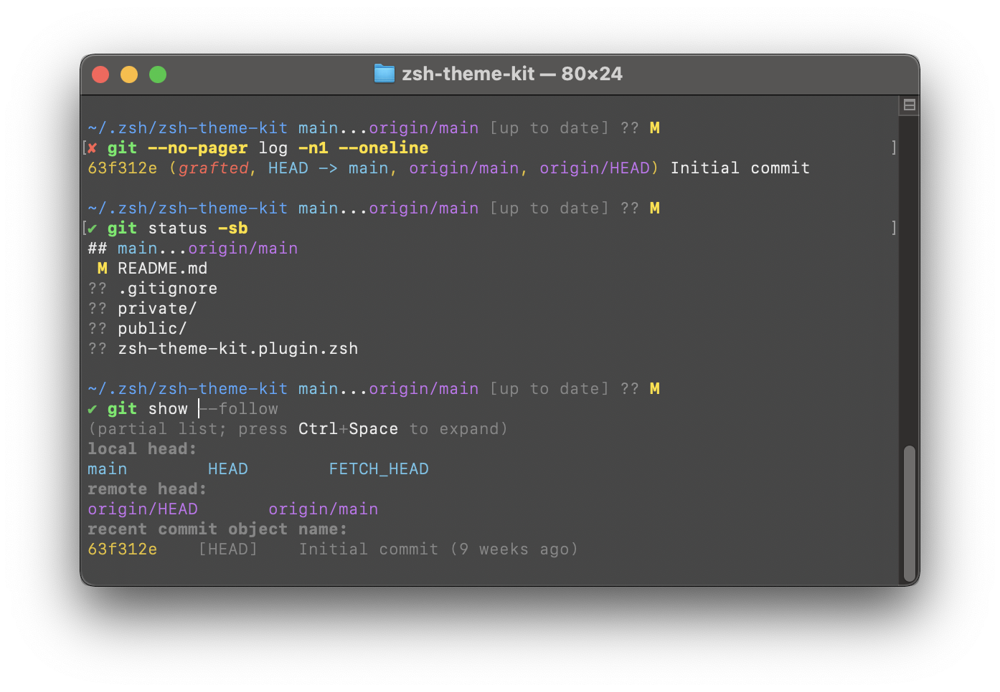

# 🌈 Z Colors
Use your `$LS_COLORS` to generate a coherent theme for `git`, `less`, `grep`, and your Zsh prompt, completions and command line.

> Enjoy this software? [Become a sponsor!](https://github.com/sponsors/marlonrichert)



## Requirements
Your `$LS_COLORS` variable needs to use 3- or 4-bit colors only. 8- and 24-bit colors are currently _not_ supported!

Alternatively, if you leave `$LS_COLORS` empty or unset, Z Colors will generate some nice defaults for you.

## Installation
Using [Znap](https://github.com/marlonrichert/zsh-snap) **(recommended)**:
1.  In your `~/.zshrc` file, add:
    ```zsh
    znap source marlonrichert/zcolors
    znap eval zcolors "zcolors ${(q)LS_COLORS}"
    ```
1.  To update, do:
    ```zsh
    % znap pull
    ```

Manually:
1.  On the command line, do:
    ```zsh
    % cd ~/Git  # or wherever you keep your Git repos/Zsh plugins
    % git clone https://github.com/marlonrichert/zcolors.git
    % autoload -Uz ~/Git/zcolors/functions/zcolors
    % zcolors >| ~/.zcolors
    ```
1.  In your `~/.zshrc` file, add:
    ```zsh
    source ~/Git/zcolors/zcolors.plugin.zsh
    source ~/.zcolors  # generated in step 1
    ```
1.  To update, do:
    ```zsh
    % git -C ~/Git/zcolors pull
    ```
1.  Whenever you change your `$LS_COLORS`, do:
    ```zsh
    % zcolors >| ~/.zcolors
    ```

## Usage
Once you've installed Z Colors with the steps above, then your `$LS_COLORS` are automatically used
in `git`, `less`, `grep` and for your Zsh completions. No other steps are required for this.

### Command Line
For your `$LS_COLORS` to be used to highlight your command line, you will need to also install
[`zsh-syntax-highlighting`](https://github.com/zsh-users/zsh-syntax-highlighting).

### Prompt
Z Colors provides a function `lscolor` that can output the current value of `di`, `ln`, `so`, `pi`,
`ex`, `bd`, `cd`, `su`, `sg`, `tw` and `ow` as a color escape code.  You can use it in your prompt
as follows:
```zsh
# di: dir color
# %{...%}: zero-width output
# %~: present working dir
# %f: reset Foreground color;  %k: reset bacKground color
# %b: reset other formatting
PS1="%{$(lscolor di)}%~%b%f%k> "
```
